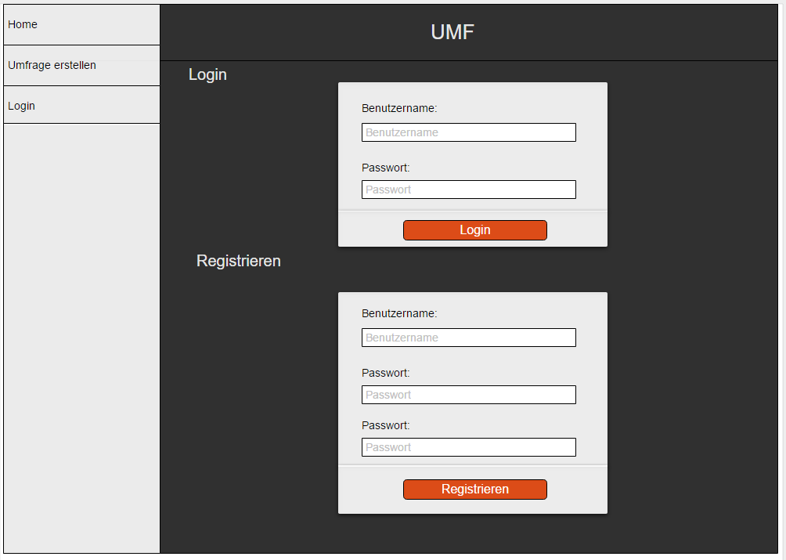

# Planung

## Mockup + Programmablaeufe

#### Home Page

#### Login Page

#### Profil Page

#### Neu Page

#### Resultat Page

#### Programmablauf

#### Klassendiagramm

#### DB Diagramm

## Aufgabenaufteilung

#### svi:

* Javascript framework integration
* PHP API

#### lwa

* HTML
* CSS
* Datenbank

## Zeitplan

#### 27.10.2016

* svi: DB Aufsetzen
* lwa, svi: PHP API Basisfunktionalitaeten implementieren

#### 28.10.2016

* lwa: Angular.js einlesen
* svi, lwa: Frontend Technologie implementieren (ohne design)
* svi: PHP API erweitern

#### 02.11.2016

* lwa: Frontend Design (mobile first)
* svi, lwa, Frontend Technologie implementieren (ohne design)

#### 03.11.2016

* svi, lwa: Frontend Design abschliessen (desktop & mobile)
* svi, lwa: Ausfuehrlich testen

## Schnittstellendefinition

* Der browser kommuniziert ueber Angular mit einer PHP API,
welche JSON akzeptiert und sendet.  
* Die PHP API kommuniziert mit einer SQL Datenbank
um die Daten zu speichern und abzurufen.  

## JS Framework

* Vue.js

Wir haben das JS Framework geändert, weil wir die Ganzen Features von Angular.js nicht brauchen und wir beide noch keine Erfahrungen mit Angular.js gemacht haben.

## PHP Framework

* Medoo

## Schnittstellendefinition

* GET getAllPolls 
* GET getNewPolls (c = count)
* GET getPollById (id = index)
* GET getPollsByUser(u = username)
* POST addPoll  
* POST login (u = username, pw = passwort)
* \* logout  
* GET getLoginInfo
* POST register (u = username, pw = passwort)
* POST vote (pid = pollId, a = ids) 

